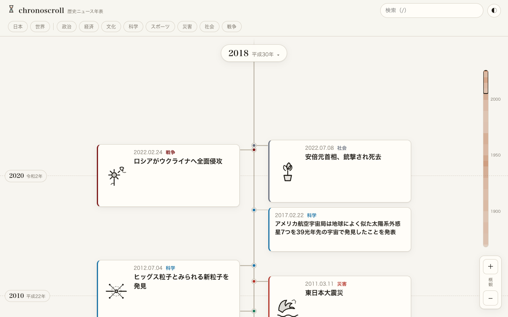
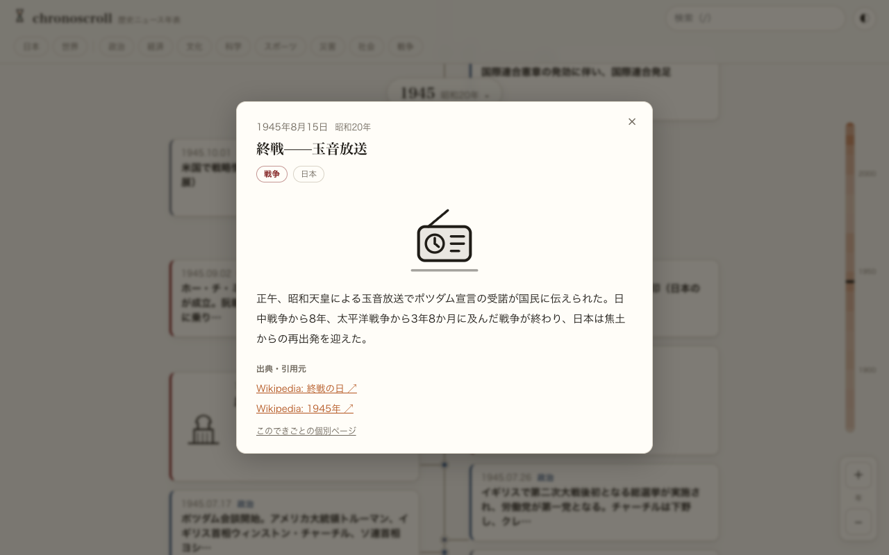
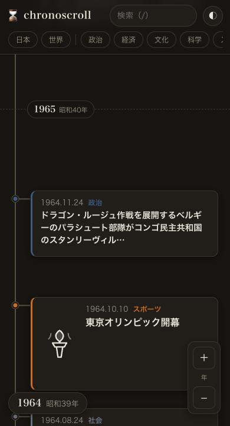

# chronoscroll

歴史ニュースを縦の無限スクロール年表で。1868（明治）〜現在の国内外13,000件超の出来事を、
ズームすると細かいニュースが現れる「セマンティックズーム」で探索できるWebサイト。



| 詳細ダイアログ | ダークモード（モバイル） |
|---|---|
|  |  |

## 特徴

- **縦スクロール年表** — 上が現在、下へスクロールすると過去へ。和暦併記・ミニマップ付き
- **セマンティックズーム** — 概観では各時代の重大ニュースのみ。拡大すると月・日レベルの出来事まで（⌘/Ctrl+ホイール、ピンチ、±ボタン、ダブルクリック）
- **オリジナルSVGピクトグラム100点** — トップ層の歴史ニュースに統一スタイルの描き起こしイラスト（currentColorでテーマ・カテゴリ色に自動追従）
- **詳細ビュー** — 画像（Wikimedia Commons）・要約・引用元（Wikipedia）リンク
- **フィルタ / 検索** — 地域（日本/世界）×カテゴリ（政治/経済/文化/科学/スポーツ/災害/社会/戦争）、日本語全文検索（Web Worker + 文字bigram索引）
- **URL共有** — 表示位置・ズーム・フィルタ・選択イベントをURLに保持
- **年代ジャンプ** — 年表示チップのタップで任意の十年へ（モバイルの主要動線）
- **イベント個別ページ** — 全13,941件をJSなしの静的HTMLとしてprerender（+sitemap.xml・前後ナビ）
- **キーボード操作** — `↑↓` 前後のイベント / `+` `-` ズーム / `/` 検索。右下のズームゲージで現在レベル（概観〜日）と可動域を常時表示

## 技術構成

- **Svelte 5 (runes) + SvelteKit + adapter-static** — サーバーレス静的サイト。ズーム/スクロールの毎フレーム更新に細粒度リアクティビティ
- **ビルド時データパイプライン**（`pipeline/`）— ja.wikipedia 年ページ「できごと」をパースし、
  Wikidata sitelinks × jaページビュー × IDF減衰 × 地名減衰で注目度をスコアリング。十年内パーセンタイル正規化
- **ハイブリッドキュレーション** — 自動生成13,000件+ `content/curated/` の手動キュレーション（トップ50の要約リライト・SVG割当）
- **仮想化タイムライン** — ネイティブスクロール+高さスペーサー、可視ウィンドウのみDOM描画、ピクセル密度ベースのLOD間引き
- **MiniSearch**（文字bigram日本語トークナイザ）による全文検索
- **Vitest** — 純ロジック層（`src/lib` + `pipeline/lib`）100% カバレッジゲート / GitHub Actions CI
- **厳格CSP**（Observatory A+ 相当設定・画像のみ upload.wikimedia.org 許可）

## 開発

```bash
npm install
npm run dev        # 開発サーバー
npm run test       # テスト
npm run coverage   # カバレッジ（lib 100%ゲート）
npm run typecheck  # svelte-check + pipeline tsc
npm run build      # 静的ビルド
npm run data:build # データ再生成（Wikipedia取得・要ネットワーク）
```

## データについて

イベントデータは Wikipedia 日本語版の各年ページ「できごと」から生成しており、
[CC BY-SA 4.0](https://creativecommons.org/licenses/by-sa/4.0/deed.ja) に従います。
各イベントは出典（Wikipedia記事）へのリンクを持ちます。画像は Wikimedia Commons のサムネイルです。

## データ規模

- 収録イベント: **27,014件**（1868-01-01 〜 現在。「YYYY年」+「YYYY年の日本」の2シリーズ+AI・テック史キュレーションを収録）
- オリジナルSVGピクトグラム: 106点 / 手動キュレーション: 391件（トップ423件を人手レビュー+AI・テック史41件を新規追加）
- 画像付きイベント: 約5,000件（Wikimedia Commonsサムネイル）

## 品質指標

- Lighthouse: **mobile 100/100/100/100・desktop 100/100/100/100**（本番URL実測 2026-07-11、LCP 1.5s/0.4s・CLS 0）
- Mozilla Observatory: **A+（score 120・10/10）**
- テスト: 191件 / `src/lib`・`pipeline/lib` 純関数層 カバレッジ100%（CIゲート）
- 実ブラウザスモーク: 17シナリオ（CIでも本番同等CSPで実行）（`node e2e/smoke.mjs`）
- npm audit: 0件
