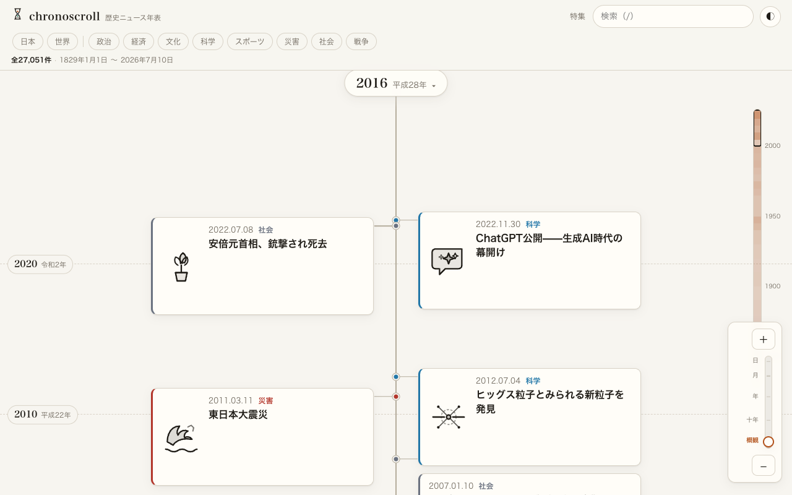
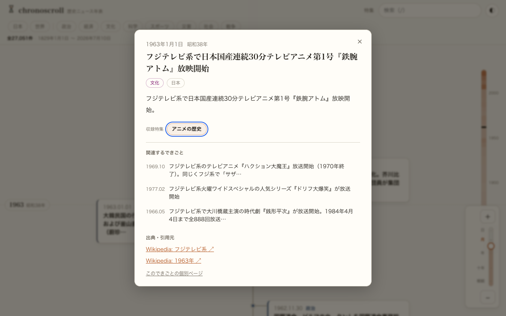
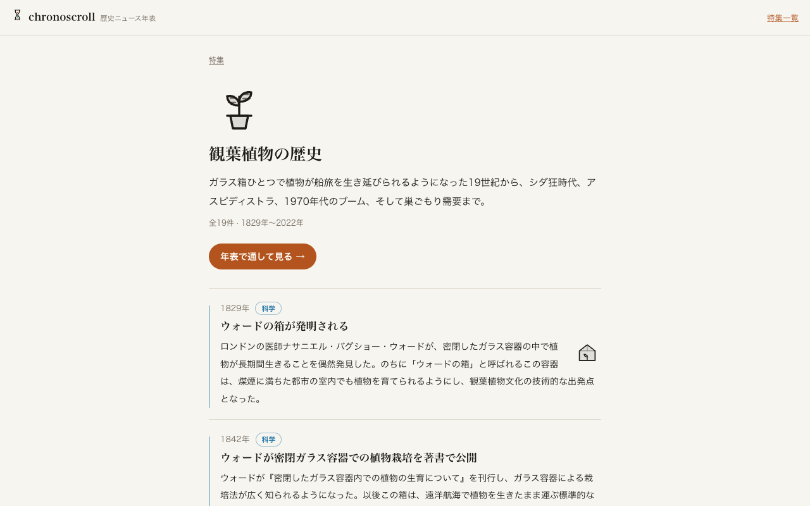
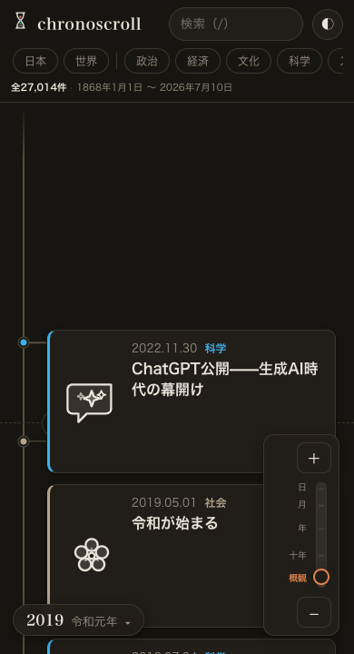

# chronoscroll

歴史ニュースを縦の無限スクロール年表で。1829〜現在の国内外27,000件超の出来事を、
ズームすると細かいニュースが現れる「セマンティックズーム」で探索できるWebサイト。
テーマ別の「特集」から歴史を1本の読み物として辿ることもできる。



| 詳細ダイアログ | 特集ページ | ダークモード（モバイル） |
|---|---|---|
|  |  |  |

## 特徴

- **縦スクロール年表** — 上が現在、下へスクロールすると過去へ。和暦併記・ミニマップ付き
- **セマンティックズーム** — 概観では各時代の重大ニュースのみ。拡大すると月・日レベルの出来事まで（⌘/Ctrl+ホイール、ピンチ、±ボタン、ダブルクリック）
- **オリジナルSVGピクトグラム114点** — トップ層の歴史ニュースに統一スタイルの描き起こしイラスト（currentColorでテーマ・カテゴリ色に自動追従）
- **特集（テーマ別の読み物）** — アニメ／ブレイクダンス／観葉植物／AI・コンピューティング／宇宙開発／鉄道／映画の**7本185件**を年代順に通読できる `/c/<slug>`（prerender・JSなし）。年表側は `?k=<slug>` でその特集だけに絞り込める
- **特集ごとのOGP画像** — `/c/<slug>` を共有すると、その特集のタイトル・リード・件数・期間が入ったカードが出る（`npm run ogp` で collections.json から生成しコミット）
- **詳細ビュー** — 画像（Wikimedia Commons）・要約・引用元（Wikipedia）リンク・関連するできごとへのリンク（同じ実体を出典に持つイベント同士を自動で結びつけ）
- **フィルタ / 検索** — 地域（日本/世界）×カテゴリ（政治/経済/文化/科学/スポーツ/災害/社会/戦争）、日本語全文検索（Web Worker + 文字bigram索引）
- **URL共有** — 表示位置・ズーム・フィルタ・選択イベントをURLに保持
- **年代ジャンプ** — 年表示チップのタップで任意の十年へ（モバイルの主要動線）
- **イベント個別ページ** — 全27,051件をJSなしの静的HTMLとしてprerender（+sitemap.xml・前後ナビ・関連リンク・収録されている特集へのリンク）
- **キーボード操作** — `↑↓` 前後のイベント / `+` `-` ズーム / `/` 検索。右下のズームゲージで現在レベル（概観〜日）と可動域を常時表示
- **収録データの明示** — ヘッダーに総件数と収録期間（`全27,051件 · 1829年1月1日 〜 2026年7月10日`）を常時表示。値はビルド時に `static/data/index.json` から焼き込むため、description/OGPにも実数が載りpop-in/CLSが起きない

## 技術構成

- **Svelte 5 (runes) + SvelteKit + adapter-static** — サーバーレス静的サイト。ズーム/スクロールの毎フレーム更新に細粒度リアクティビティ
- **ビルド時データパイプライン**（`pipeline/`）— ja.wikipedia 年ページ「できごと」をパースし、
  Wikidata sitelinks × jaページビュー × IDF減衰 × 地名減衰で注目度をスコアリング。十年内パーセンタイル正規化
- **ハイブリッドキュレーション** — 自動生成27,000件+ `content/curated/` の手動キュレーション391件（要約リライト・SVG割当・関連リンク手動指定）+ `content/collections/` の特集7本185件（うち37件は年ページに載らないテーマ史を出典つきで新規執筆）
- **関連イベント算出** — 同じWikipedia記事を出典に持つイベント同士を自動で結びつけ（`pipeline/lib/related.ts`）。地名的な記事は除外し誤結合を防止
- **仮想化タイムライン** — ネイティブスクロール+高さスペーサー、可視ウィンドウのみDOM描画、ピクセル密度ベースのLOD間引き
- **MiniSearch**（文字bigram日本語トークナイザ）による全文検索
- **Vitest** — 純ロジック層（`src/lib` + `pipeline/lib`）100% カバレッジゲート / GitHub Actions CI
- **厳格CSP**（Observatory A+ 相当設定・画像のみ upload.wikimedia.org 許可）

## 開発

```bash
npm install
npm run dev        # 開発サーバー
npm run test       # テスト
npm run coverage   # カバレッジ（lib 100%ゲート）
npm run typecheck  # svelte-check + pipeline tsc
npm run build      # 静的ビルド
npm run data:build # データ再生成（Wikipedia取得・要ネットワーク）
```

## データについて

イベントデータは Wikipedia 日本語版の各年ページ「できごと」から生成しており、
[CC BY-SA 4.0](https://creativecommons.org/licenses/by-sa/4.0/deed.ja) に従います。
各イベントは出典（Wikipedia記事）へのリンクを持ちます。画像は Wikimedia Commons のサムネイルです。

## データ規模

- 収録イベント: **27,051件**（1829-01-01 〜 現在。「YYYY年」+「YYYY年の日本」の2シリーズ+特集キュレーションを収録）
- 特集: **7本 / 185件**（宇宙開発33・AI/コンピューティング41・鉄道26・アニメ25・映画23・観葉植物19・ブレイクダンス18。うち37件は新規執筆、残りは既存イベントのキュレーション）
- オリジナルSVGピクトグラム: 114点 / 手動キュレーション: 391件（トップ423件を人手レビュー）
- 画像付きイベント: 約5,000件（Wikimedia Commonsサムネイル）
- 関連リンク付きイベント: 10,666件（全体の約39%。自動算出+手動指定40件）

## 品質指標

- Lighthouse: **mobile 98/100/100/100・desktop 100/100/100/100**（本番URL実測 2026-07-30・mobile perfはmedian-of-3、LCP 2.3s・CLS 0・TBT 0ms）
  - 特集ページ（JSなしの静的HTML）は mobile **`/c` 99・`/c/anime` 100**（LCP 0.9〜1.1s・CLS 0）
- Mozilla Observatory: **A+（score 120・10/10）**（2026-07-30再スキャン）
- テスト: 287件 / `src/lib`・`pipeline/lib` 純関数層 カバレッジ100%（CIゲート）
- 実ブラウザスモーク: 37シナリオ（CIでも本番同等CSPで実行。280〜1280pxの横あふれ検証を含む）（`node e2e/smoke.mjs`）
- npm audit: 0件
